# Проектная работа

## Построение отказоустойчивого кластера Zabbix на базе PostgreSQL, Nginx, CephFS

### Описание

Программный комплекс выполнен в отказоустойчивом исполнении и включает в себя следующие программные продукты:

| Программный продукт | Описание                                                |
|---------------------|---------------------------------------------------------|
| Zabbix              | Система мониторинга                                     |
| Patroni             | Конфигурация и обслуживание кластера PostgreSQL         |
| PGBouncer           | Пуллинг соединений к PostgreSQL                         |
| Keepalived          | Обеспечение высокой доступности сервисов                |
| HAProxy             | Обеспечение высокой доступности и балансировки нагрузки |
| Consul              | Обнаружение, конфигурирование распределенных сервисов   |
| Pacemaker           | Управление сервисами высокой доступности                |
| Bacula              | Система резервного копирования                          |
| Journald-remote     | Централизованный сбор журналов ОС и сервисов            |
| Ceph                | Распределенное хранилище данных                         |


#### Логическая схема стенда
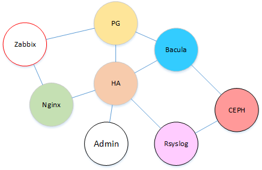


#### Физическая схема стенда
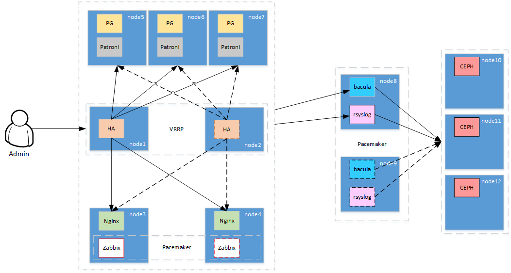


#### Перечень используемых IP адресов

| IP адрес    | Имя сервера                   | Назначение                                                         |
|-------------|-------------------------------|--------------------------------------------------------------------|
| 10.10.10.1  | pg01.otus.loc                 | Сервер БД                                                          |
| 10.10.10.2  | pg02.otus.loc                 | Сервер БД                                                          |
| 10.10.10.3  | pg03.otus.loc                 | Сервер БД                                                          |
| 10.10.10.4  | ha01.otus.loc                 | Сервер балансировки + Consul                                       |
| 10.10.10.5  | ha02.otus.loc                 | Сервер балансировки + Consul                                       |
| 10.10.10.6  | ha03.otus.loc                 | Сервер балансировки + Consul                                       |
| 10.10.10.7  | zmon01.otus.loc               | Сервер мониторинга Zabbix                                          |
| 10.10.10.8  | zmon01.otus.loc               | Сервер мониторинга Zabbix                                          |
| 10.10.10.9  | bkp01.otus.loc                | Сервер резервного копирования Bacula и сервер сбора логов Journald |
| 10.10.10.10 | bkp02.otus.loc                | Сервер резервного копирования Bacula и сервер сбора логов Journald |
| 10.10.10.11 | ceph01.otus.loc               | Сервер распределенного хранилища Ceph                              |
| 10.10.10.12 | ceph02.otus.loc               | Сервер распределенного хранилища Ceph                              |
| 10.10.10.13 | ceph03.otus.loc               | Сервер распределенного хранилища Ceph                              |
| 10.10.10.14 | pg.otus.loc, dcs.otus.ooc     | VIP адрес кластера БД + Consul                                     |
| 10.10.10.15 | zmon.otus.loc                 | VIP адрес сервера мониторинга Zabbix                               |
| 10.10.10.16 | zweb.otus.loc                 | VIP адрес веб консоли сервера мониторинга Zabbix                   |
| 10.10.10.17 | bkp.otus.loc                  | VIP адрес сервера резервного копирования Bacula                    |
| 10.10.10.18 | log.otus.loc                  | VIP адрес сервера централизованного сбора логов Journald           |


#### Перечень используемых учетных записей

| Система    | Логин      | Пароль              | Назначение                           |
| ---------- | ---------- | ------------------- | ------------------------------------ |
| Bacula     | -          | bacula-dir-password | Director демон сервера Bacula        |
| Bacula     | -          | bacula-fd-password  | Файловый демон клиентов Bacula       |
| Bacula     | -          | bacula-sd-password  | Storage демон сервера Bacula         |
| HAProxy    | admin      | adminotus           | Пользователь веб консоли HAProxy     |
| Pacemaker  | hacluster  | otuscluster         | Пользователь в ОС кластера Pacemaker |
| PostgreSQL | admin      | admin               | Пользователь БД                      |
| PostgreSQL | bacula     | bacula              | Пользователь БД. Схема bacula        |
| PostgreSQL | postgres   | 123456              | Пользователь БД                      |
| PostgreSQL | replicator | 123456              | Пользователь реплиции БД             |
| PostgreSQL | zabbix     | zabbix              | Пользователь БД. Схема zabbix        |
| Zabbix     | Admin      | zabbbix             | Пользователь веб консоли Zabbix      |


### Запуск стенда

Для развертывания стенда используется *[Vagrant](https://www.vagrantup.com/)* с применением системы автоматического конфигурирования *Ansible*.

Запуск стенда выполняется командой:

```bash
[otus@vagrant project] $ vagrant up
```

Запуск стенда в конфигурационном файле `Vagrantfile` описан в следующей последовательности:

1. Развертывание *Ceph* кластера
    1. ceph01
    2. ceph02
    3. ceph03
2. Развертывание кластера балансировки нагрузки c кластером *Consul*
    1. ha01
    2. ha02
    3. ha03
3. Развертывание кластера БД *PostgreSQL*
    1. pg01
    2. pg02
    3. pg03
4. Развертывание кластера мониторинга и резервного копирования
    1. zmon01
    2. zmon02
    3. bkp01
    4. bkp02

На всех узлах стенда включен firewalld и SELinux, а также установлен zabbix-agent и bacula-fd.


### Кластер БД PostgreSQL

В данном проекте для построения отказоустойчивого кластера *PostgreSQL* было выбрано ПО *Patroni*.

*Patroni* — это демон на python, позволяющий выполнять автоматическую конфигурацию кластеров *PostgreSQL* и автоматически переключать роли узлов.

В качестве DCS (Distributed Configuration Store) хранилища в проекте использовано ПО *Consul*. Через *Consul* узлы кластера выполняют регистрацию (сообщают о себе) и координацию состояний между всеми узлами.

Для пуллинга входящих соединений к *PostgreSQL* использовано ПО *PGBouncer*.

Для обспечения единой точки входа трафика к БД использовано ПО *HAProxy*.

Для определения какой из узлов БД является лидером, *HAProxy* периодически выполняет проверку порта 8008 на узлах кластера и выполняет перенаправление трафика только к активному узлу кластера.

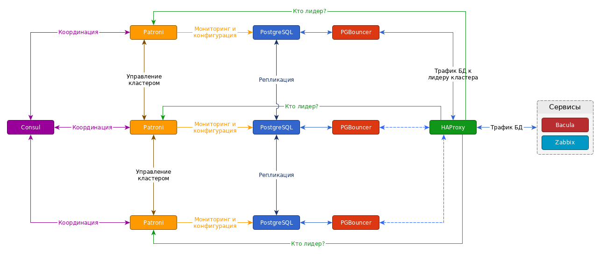


#### Развертывание

Развертывание кластера БД происходит при помощи механизма bootstrap ПО *Patroni*. Для инициализации кластера готовыми экземлярами БД *Zabbix* и *Bacula* в директиве `post_init` раздела `bootstrap` в конфигурационном файле `patroni.yml` осуществляется запуск скрипта `import_dbs.sh`, в котором выполняется первичный импорт БД в инициализируемый кластер.


#### Проверка работоспособности

* Проверим состояние кластера:

```bash
[root@pg01 ~] # patronictl -c /opt/app/patroni/etc/postgresql.yml list
+---------+--------+------------+--------+---------+----+-----------+
| Cluster | Member |    Host    |  Role  |  State  | TL | Lag in MB |
+---------+--------+------------+--------+---------+----+-----------+
|   otus  |  pg01  | 10.10.10.1 | Leader | running |  2 |         0 |
|   otus  |  pg02  | 10.10.10.2 |        | running |  2 |         0 |
|   otus  |  pg03  | 10.10.10.3 |        | running |  2 |         0 |
+---------+--------+------------+--------+---------+----+-----------+
```

* Выполним подключение к БД через VIP адрес и проверим наличие БД:

```bash
[otus@vagrant project] $ psql -h 10.10.10.14 -Upostgres
Password for user postgres: 
psql (12.1)
Type "help" for help.

postgres=# \l
                                  List of databases
   Name    |  Owner   | Encoding  |   Collate   |    Ctype    |   Access privileges   
-----------+----------+-----------+-------------+-------------+-----------------------
 bacula    | bacula   | SQL_ASCII | en_US.UTF-8 | en_US.UTF-8 | 
 postgres  | postgres | UTF8      | en_US.UTF-8 | en_US.UTF-8 | 
 template0 | postgres | UTF8      | en_US.UTF-8 | en_US.UTF-8 | =c/postgres          +
           |          |           |             |             | postgres=CTc/postgres
 template1 | postgres | UTF8      | en_US.UTF-8 | en_US.UTF-8 | =c/postgres          +
           |          |           |             |             | postgres=CTc/postgres
 zabbix    | zabbix   | UTF8      | en_US.UTF-8 | en_US.UTF-8 | 
(5 rows)
```

* Выполним перевод лидера на другой узел:

```bash
[root@pg01 ~] # patronictl -c /opt/app/patroni/etc/postgresql.yml switchover
Master [pg01]: 
Candidate ['pg02', 'pg03'] []: pg03
When should the switchover take place (e.g. 2020-02-03T20:49 )  [now]: 
Current cluster topology
+---------+--------+------------+--------+---------+----+-----------+
| Cluster | Member |    Host    |  Role  |  State  | TL | Lag in MB |
+---------+--------+------------+--------+---------+----+-----------+
|   otus  |  pg01  | 10.10.10.1 | Leader | running |  2 |         0 |
|   otus  |  pg02  | 10.10.10.2 |        | running |  2 |         0 |
|   otus  |  pg03  | 10.10.10.3 |        | running |  2 |         0 |
+---------+--------+------------+--------+---------+----+-----------+
Are you sure you want to switchover cluster otus, demoting current master pg01? [y/N]: y
2020-02-03 19:49:26.14861 Successfully switched over to "pg03"
+---------+--------+------------+--------+---------+----+-----------+
| Cluster | Member |    Host    |  Role  |  State  | TL | Lag in MB |
+---------+--------+------------+--------+---------+----+-----------+
|   otus  |  pg01  | 10.10.10.1 |        | running |  3 |         0 |
|   otus  |  pg02  | 10.10.10.2 |        | running |  3 |         0 |
|   otus  |  pg03  | 10.10.10.3 | Leader | running |  3 |         0 |
+---------+--------+------------+--------+---------+----+-----------+
```

* Выполним проверку автоматического переключения лидера:

```bash
[root@pg01 ~] # patronictl -c /opt/app/patroni/etc/postgresql.yml list
+---------+--------+------------+--------+---------+----+-----------+
| Cluster | Member |    Host    |  Role  |  State  | TL | Lag in MB |
+---------+--------+------------+--------+---------+----+-----------+
|   otus  |  pg01  | 10.10.10.1 |        | running |  3 |         0 |
|   otus  |  pg02  | 10.10.10.2 |        | running |  3 |         0 |
|   otus  |  pg03  | 10.10.10.3 | Leader | running |  3 |         0 |
+---------+--------+------------+--------+---------+----+-----------+


[otus@vagrant project] $ vagrant destroy pg03


[root@pg01 ~]# patronictl -c /opt/app/patroni/etc/postgresql.yml list
+---------+--------+------------+--------+---------+----+-----------+
| Cluster | Member |    Host    |  Role  |  State  | TL | Lag in MB |
+---------+--------+------------+--------+---------+----+-----------+
|   otus  |  pg01  | 10.10.10.1 |        | running |  4 |         0 |
|   otus  |  pg02  | 10.10.10.2 | Leader | running |  4 |         0 |
+---------+--------+------------+--------+---------+----+-----------+
```


###  Кластер балансировки нагрузки

Для обеспечения единой точки входа для трафика БД *PostgreSQL*  используется ПО *HAProxy*.

*HAProxy* одновременно работает на трёх узлах, но трафик попадает только на один узел через VIP адрес, конфигурирование и анонсирование которого обеспечивает сервис *Keepalived*, также работающий на этих узлах.

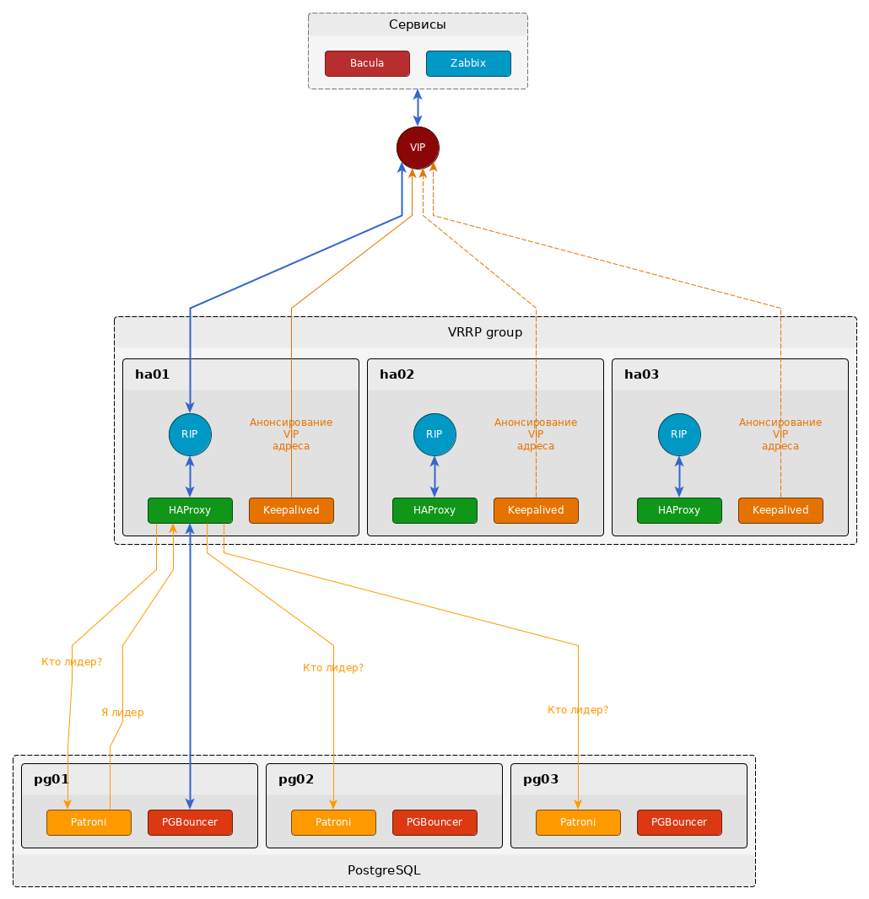


#### Развертывание

Особенностей при разворачивании кластера нет. Сервис keepalived автоматически определяет *master* узел по протоколу VRRP и поднимает на нем VIP (**10.10.10.14**) адрес.


#### Проверка рабоспособности

* Проверим расположение VIP адреса:

```bash
[root@ha01 ~]# ip -4 a sh dev eth1
3: eth1: <BROADCAST,MULTICAST,UP,LOWER_UP> mtu 1500 qdisc pfifo_fast state UP group default qlen 1000
    inet 10.10.10.4/27 brd 10.10.10.31 scope global noprefixroute eth1
       valid_lft forever preferred_lft forever
       

[root@ha02 ~]# ip -4 a sh dev eth1
3: eth1: <BROADCAST,MULTICAST,UP,LOWER_UP> mtu 1500 qdisc pfifo_fast state UP group default qlen 1000
    inet 10.10.10.5/27 brd 10.10.10.31 scope global noprefixroute eth1
       valid_lft forever preferred_lft forever
    inet 10.10.10.14/27 scope global secondary eth1
       valid_lft forever preferred_lft forever
       

[root@ha03 ~]# ip -4 a sh dev eth1
3: eth1: <BROADCAST,MULTICAST,UP,LOWER_UP> mtu 1500 qdisc pfifo_fast state UP group default qlen 1000
    inet 10.10.10.6/27 brd 10.10.10.31 scope global noprefixroute eth1
       valid_lft forever preferred_lft forever
```

* Выполним подключение к БД через VIP адрес:

```bash
[otus@vagrant project] $ psql -h 10.10.10.14 -Upostgres
Password for user postgres: 
psql (12.1)
Type "help" for help.

postgres=#
```

* Выключим узел `ha02`. Проверим расположение VIP адреса и выполним подключение через VIP адрес к БД:

```bash
[otus@vagrant project] $ vagrant destroy ha02


[root@ha01 ~]# ip -4 a sh dev eth1
3: eth1: <BROADCAST,MULTICAST,UP,LOWER_UP> mtu 1500 qdisc pfifo_fast state UP group default qlen 1000
    inet 10.10.10.4/27 brd 10.10.10.31 scope global noprefixroute eth1
       valid_lft forever preferred_lft forever
    inet 10.10.10.14/27 scope global secondary eth1
       valid_lft forever preferred_lft forever
      

[root@ha03 ~]# ip -4 a sh dev eth1
3: eth1: <BROADCAST,MULTICAST,UP,LOWER_UP> mtu 1500 qdisc pfifo_fast state UP group default qlen 1000
    inet 10.10.10.6/27 brd 10.10.10.31 scope global noprefixroute eth1
       valid_lft forever preferred_lft forever


[otus@vagrant project] $ psql -h 10.10.10.14 -Upostgres
Password for user postgres: 
psql (12.1)
Type "help" for help.

postgres=#
```

* Проверим веб консоль *HAProxy* (http://10.10.10.14:8080). Пользователь `admin`, пароль `adminotus`:

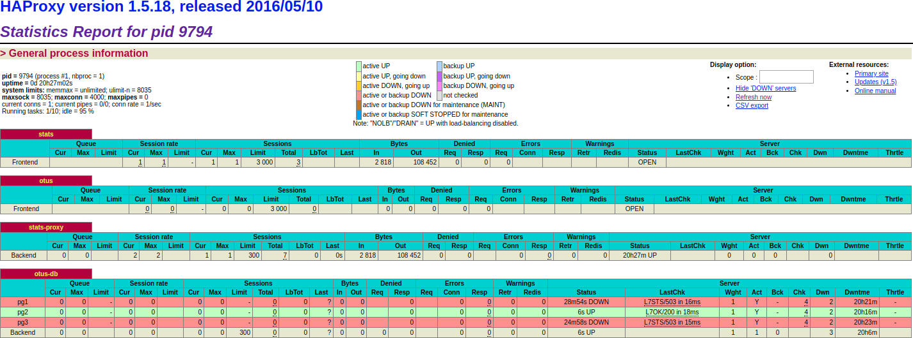


### Кластер Consul

В качестве распределенного хранилища конфигурации (DCS) для проекта было выбрано ПО *Consul*.

Для корректной работы кворума минимальное число узлов в кластере согласно [документации](https://www.consul.io/docs/internals/consensus.html) должно быть не менее трех.

В кластере активны все узлы *Consul*, но трафик от *Patroni* идет через VIP адрес только на один узел. Узлы между собой синхронизируются по протоколу *Raft*.

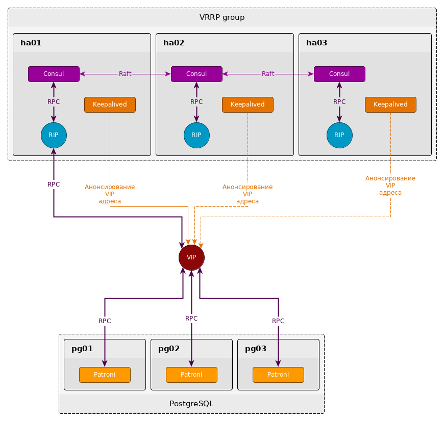


#### Развертывание

Развертывание кластера проходит обыкновенной последовательной инсталляцией узлов с заданным конфигурационным файлом.
При достижении кворума кластер автоматически переходит в состояние bootstraping, которое выполняет первичную инициализацию и согласованость узлов в кластере. Далее кластер переходит в работоспособное состояние.


#### Проверка работоспособности

* Проверим состояние узлов в кластере:

```bash
[root@ha01 ~]# consul members
Node           Address          Status  Type    Build  Protocol  DC       Segment
ha01.otus.loc  10.10.10.4:8301  alive   server  1.6.2  2         otus-dc  <all>
ha02.otus.loc  10.10.10.5:8301  alive   server  1.6.2  2         otus-dc  <all>
ha03.otus.loc  10.10.10.6:8301  alive   server  1.6.2  2         otus-dc  <all>
```

* Выполним запись:

```bash
[root@ha01 ~]# consul kv put otus/test/key 777
```

* Проверим что ключ доступен через VIP. Значение ключа выводится в base64 кодировке:

```bash
[root@ha01 ~]# curl http://10.10.10.14:8500/v1/kv/otus/test/key
[{"LockIndex":0,"Key":"otus/test/key","Flags":0,"Value":"Nzc3","CreateIndex":228,"ModifyIndex":228}]
```

* Выключим узел `ha01` и проверим доступность ключа через VIP снова:

```bash
[otus@vagrant project] $ vagrant destroy ha01


[root@ha02 ~]# curl http://10.10.10.14:8500/v1/kv/otus/test/key
[{"LockIndex":0,"Key":"otus/test/key","Flags":0,"Value":"Nzc3","CreateIndex":228,"ModifyIndex":228}]
```

* Проверим веб консоль *Consul* (http://10.10.10.14:8500):

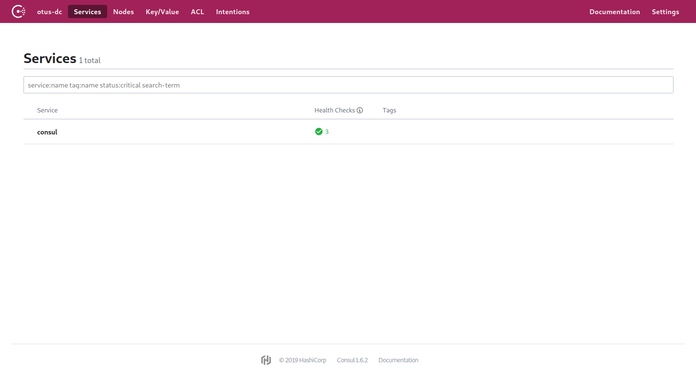


### Кластер Pacemaker

Для построения кластера высокой доступности для сервисов *Zabbix*, *Bacula* и *Journald-remote* выбрано ПО *Pacemaker*. Данное ПО отвечает за переключение подчиненных сервисов между узлами кластера при их (узлов) отказах.

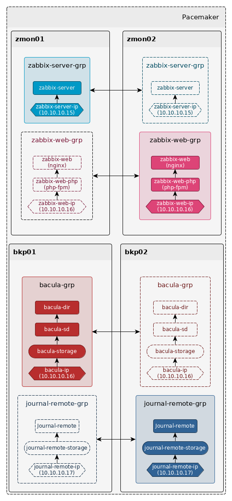

Так как в кластере использованы ресурсы без сложных зависимостей и связей, то вместо ограничений **Colocation** и **Order** использована группировка ресурсов. В рамках группы ресурсы запускаются на одном узле и в последовательности, указанной в группе.

При конфигурации кластера созданы 4-е группы ресурсов:

* zabbix-server-grp
	* zabbix-server-ip - VIP адрес: **10.10.10.15**
	* zabbix-server - systemd сервис zabbix-server
* zabbix-web-grp
	* zabbix-web-ip - VIP адрес: **10.10.10.16**
	* zabbix-web-php - systemd сервис php-fpm
	* zabbix-web - systemd сервис nginx
* bacula-grp
  * bacula-ip - VIP адрес: **10.10.10.17**
  * bacula-storage - сервис монтирования *Ceph* устройств
  * bacula-sd - systemd сервис bacula-sd
  * bacula-dir - systemd сервис bacula-dir
* journal-remote-grp
  * journal-remote-ip - VIP адрес: **10.10.10.18**
  * journal-remote-storage - сервис монтирования *Ceph* устройств
  * journal-remote - systemd сервис journald-remote

Для каждой группы заданы ограничения **Location** на каких узлах разрешено их запускать. Таким образом, в нормальном состоянии работы кластера все ресурсы равномерно распределены между узлами. В случае отказов узлов ресурсы переводятся на резервные в соответствии со следующей таблицей:

| Группа ресурсов    | Основной узел | Разрешенные узлы | Запрещенные узлы |
| ------------------ | ------------- | ---------------- | ------------------- |
| zabbix-server-grp  | zmon01        | zmon01, zmon02   | bkp01, bkp02        |
| zabbix-web-grp     | zmon02        | zmon01, zmon02   | bkp01, bkp02        |
| bacula-grp         | bkp01         | bkp01, bkp02     | zmon01, zmon02      |
| journal-remote-grp | bkp02         | bkp01, bkp02     | zmon01, zmon02      |


#### Развертывание

Развертывание происходит последовательной инсталляцией ПО на узлы и импортом заранее экспортированной конфигурации.


#### Проверка работоспособности

* Проверим состояние кластера:

```bash
[root@zmon01 ~]# pcs status
Cluster name: moncluster
Stack: corosync
Current DC: zmon01 (version 1.1.20-5.el7_7.2-3c4c782f70) - partition with quorum
Last updated: Wed Feb  5 18:41:06 2020
Last change: Wed Feb  5 18:39:01 2020 by root via cibadmin on zmon01

4 nodes configured
12 resources configured

Online: [ bkp01 bkp02 zmon01 zmon02 ]

Full list of resources:

 Resource Group: zabbix-web-grp
     zabbix-web-ip      (ocf::heartbeat:IPaddr2):       Started zmon02
     zabbix-web-php     (systemd:php-fpm):      Started zmon02
     zabbix-web (ocf::heartbeat:nginx): Started zmon02
 Resource Group: zabbix-server-grp
     zabbix-server-ip   (ocf::heartbeat:IPaddr2):       Started zmon01
     zabbix-server      (systemd:zabbix-server):        Started zmon01
 Resource Group: journal-remote-grp
     journal-remote-ip  (ocf::heartbeat:IPaddr2):       Started bkp02
     journal-remote-storage     (ocf::heartbeat:Filesystem):    Started bkp02
     journal-remote     (systemd:systemd-journal-remote):       Started bkp02
 Resource Group: bacula-grp
     bacula-ip  (ocf::heartbeat:IPaddr2):       Started bkp01
     bacula-storage     (ocf::heartbeat:Filesystem):    Started bkp01
     bacula-sd  (systemd:bacula-sd):    Started bkp01
     bacula-dir (systemd:bacula-dir):   Started bkp01

Daemon Status:
  corosync: active/enabled
  pacemaker: active/enabled
  pcsd: active/enabled
```

* Выключим узел `bkp01` и проверим, что ресурсы с выключенного сервера автоматически переведены на резервный:

```bash
[otus@vagrant project] $ vagrant destroy bkp01


[root@zmon01 ~]# pcs status
Cluster name: moncluster
Stack: corosync
Current DC: zmon01 (version 1.1.20-5.el7_7.2-3c4c782f70) - partition with quorum
Last updated: Wed Feb  5 18:47:02 2020
Last change: Wed Feb  5 18:46:41 2020 by hacluster via crmd on bkp02

4 nodes configured
12 resources configured

Online: [ bkp02 zmon01 zmon02 ]
OFFLINE: [ bkp01 ]

Full list of resources:

 Resource Group: zabbix-web-grp
     zabbix-web-ip      (ocf::heartbeat:IPaddr2):       Started zmon02
     zabbix-web-php     (systemd:php-fpm):      Started zmon02
     zabbix-web (ocf::heartbeat:nginx): Started zmon02
 Resource Group: zabbix-server-grp
     zabbix-server-ip   (ocf::heartbeat:IPaddr2):       Started zmon01
     zabbix-server      (systemd:zabbix-server):        Started zmon01
 Resource Group: journal-remote-grp
     journal-remote-ip  (ocf::heartbeat:IPaddr2):       Started bkp02
     journal-remote-storage     (ocf::heartbeat:Filesystem):    Started bkp02
     journal-remote     (systemd:systemd-journal-remote):       Started bkp02
 Resource Group: bacula-grp
     bacula-ip  (ocf::heartbeat:IPaddr2):       Started bkp02
     bacula-storage     (ocf::heartbeat:Filesystem):    Started bkp02
     bacula-sd  (systemd:bacula-sd):    Started bkp02
     bacula-dir (systemd:bacula-dir):   Started bkp02

Daemon Status:
  corosync: active/enabled
  pacemaker: active/enabled
  pcsd: active/enabled
```


### Кластер Ceph

Кластер *Ceph* обеспечивает распределенное хранилище для системы резервного копирования *Bacula* и системы централизованного сбора журналов *Systemd-journal-remote*.

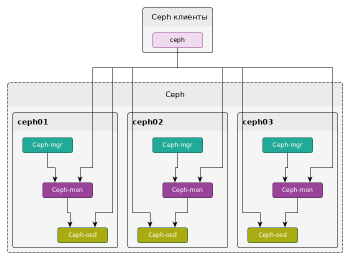


#### Развертывание

Развертывание кластера проходит в несколько этапов:

1. Запуск узла.
2. Первичная настройка ОС и установка ПО *Ceph*.
3. Определение количества доступных узлов ceph и распространение на них конфигурации кластера через механизм ansible `delegate_to`.
4. Конфигурация и запуск сервиса ceph-mon.
5. Конфигурация и запуск сервиса ceph-mgr.
6. Конфигурация и запуск сервиса ceph-osd.
7. Если пул не создан, создание пула
8. Если количество доступных узлов кластера более 2, выполняется создание rbd устройств.

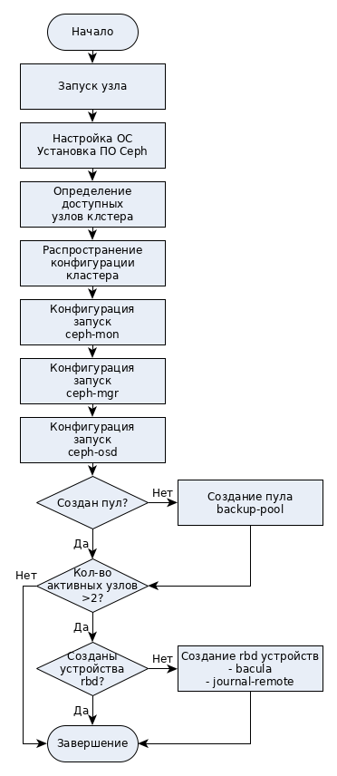

Так как при выполнении манипуляций в кластере необходим кворум, то, если в начальной конфигурации указать все узлы `ceph01, ceph02, ceph03`, при разворачивании узлов возникнут блокировки на манипуляции в кластере (кластер будет не в состоянии *HEALTH_OK*). Чтобы этого избежать, применен подход постепенного раворачивания кластера, т.е. в конфигурацию кластера узлы добавляются постепенно.


#### Проверка работоспособности

* Проверим состояние кластера:

```bash
# ceph -s
  cluster:
    id:     cf1f074b-dadb-5eb8-9eb0-55828273fab7
    health: HEALTH_OK

  services:
    mon: 3 daemons, quorum ceph01,ceph02,ceph03 (age 3h)
    mgr: ceph01(active, since 3h), standbys: ceph03, ceph02
    osd: 3 osds: 3 up (since 3h), 3 in (since 3h)

  data:
    pools:   1 pools, 128 pgs
    objects: 36 objects, 75 MiB
    usage:   3.2 GiB used, 27 GiB / 30 GiB avail
    pgs:     128 active+clean
```

* Проверим состояние `OSD` узлов:

```bash
# ceph osd tree
ID CLASS WEIGHT  TYPE NAME       STATUS REWEIGHT PRI-AFF
-1       0.02939 root default
-3       0.00980     host ceph01
 0   hdd 0.00980         osd.0       up  1.00000 1.00000
-5       0.00980     host ceph02
 1   hdd 0.00980         osd.1       up  1.00000 1.00000
-7       0.00980     host ceph03
 2   hdd 0.00980         osd.2       up  1.00000 1.00000
```

* Проверим наличие пула `backup-pool`:

```bash
# ceph osd pool ls
backup-pool
```

* Проверим наличие `rbd` устройств в пуле:

```bash
# rbd ls backup-pool
bacula
journal-remote
```

### Systemd-journal-remote

В качестве централизованной системы сборов лого был выбран systemd-journal-remote. 

Отказоустойчивость сервиса обеспечивает кластер *Pacemaker*. Информация с журналов удаленных систем сохраняется в распределенном хранилище, предоставленном кластером *Ceph*.

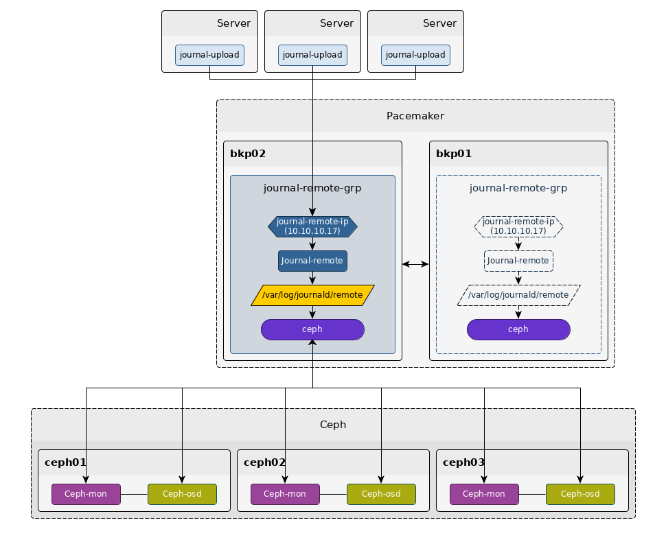


#### Развертывание

Развертывание проходит последовательной инсталляцией ПО `systemd-journal-remote` на узлы `bkp01` и `bkp02`.


#### Проверка работоспособности

* Проверим, что сервис запущен на узле `bkp02`:

```bash
[root@bkp02 ~]# systemctl status systemd-journal-remote
● systemd-journal-remote.service - Journal Remote Sink Service
   Loaded: loaded (/usr/lib/systemd/system/systemd-journal-remote.service; indirect; vendor preset: disabled)
  Drop-In: /etc/systemd/system/systemd-journal-remote.service.d
           └─custom.conf
   Active: active (running) since Wed 2020-02-05 19:31:57 MSK; 40s ago
 Main PID: 6248 (systemd-journal)
   Status: "Processing requests..."
   CGroup: /system.slice/systemd-journal-remote.service
           └─6248 /usr/lib/systemd/systemd-journal-remote --listen-http=-3 --output=/var/log/journal/remote/
```

* Проверим, что осуществляется сбор информации с журналов удаленных систем:

```bash
[root@bkp02 ~]# journalctl -efn -D /var/log/journal/remote/
:
Feb 05 12:50:50 ha03.otus.loc systemd[1]: Stopped Journal Remote Upload Service.
Feb 05 12:50:50 ha03.otus.loc systemd[1]: Started Journal Remote Upload Service.
:
:
Feb 05 13:05:06 zmon02.otus.loc systemd[1]: Stopped Journal Remote Upload Service.
Feb 05 13:05:06 zmon02.otus.loc systemd[1]: Started Journal Remote Upload Service.
```


### Bacula

В качестве  системы резервного копирования было выбрано ПО *Bacula*. 

Отказоустойчивость сервиса обеспечивает кластер *Pacemaker*.

Демон `bacula-sd` в качестве хранилища резервных копий клиентов использует распределенное хранилище, которое предоставляет кластер *Ceph*.

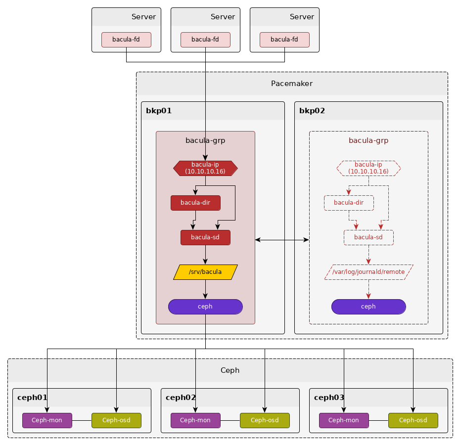


#### Развертывание

Развертывание проходит последовательной инсталляцией ПО `bacula-dir` и `bacula-sd` на узлы `bkp01` и `bkp02` и сохранением конфигурационных файлов и файлов задач резервного копирования клиентов.


#### Проверка работоспособности

* Проверим статусы `Director` и `Storage`:

```bash
*status dir
bacula-dir Version: 5.2.13 (19 February 2013) x86_64-redhat-linux-gnu redhat (Core)
Daemon started 05-Feb-20 22:05. Jobs: run=2, running=1 mode=0,0
 Heap: heap=143,360 smbytes=120,721 max_bytes=121,026 bufs=456 max_bufs=474
:
:


*status stor
Automatically selected Storage: backup-sd
Connecting to Storage daemon backup-sd at bkp.otus.loc:9103

bacula-sd Version: 5.2.13 (19 February 2013) x86_64-redhat-linux-gnu redhat (Core)
Daemon started 05-Feb-20 21:07. Jobs: run=13, running=0.
 Heap: heap=135,168 smbytes=180,985 max_bytes=399,334 bufs=109 max_bufs=180
 Sizes: boffset_t=8 size_t=8 int32_t=4 int64_t=8 mode=0,0
 :
 :
```

* Проверим состояние любого клиента:

```bash
*status client=ceph01
Connecting to Client ceph01 at 10.10.10.11:9102

ceph01 Version: 5.2.13 (19 February 2013)  x86_64-redhat-linux-gnu redhat (Core)
Daemon started 04-Feb-20 21:20. Jobs: run=2 running=0.
 Heap: heap=135,168 smbytes=175,980 max_bytes=406,635 bufs=77 max_bufs=157
 Sizeof: boffset_t=8 size_t=8 debug=0 trace=0
```

* Запустим резервную копию клиента и проверим, что она завершилась успешно:

```bash
*run
A job name must be specified.
The defined Job resources are:
     1: bkp01_fs
     2: bkp02_fs
     3: ceph01_fs
     4: ceph02_fs
     5: ceph03_fs
     6: ha01_fs
     7: ha02_fs
     8: ha03_fs
     9: pg01_fs
    10: pg01_db
    11: pg02_fs
    12: pg03_fs
    13: zmon01_fs
    14: zmon02_fs
Select Job resource (1-14): 6
Run Backup job
JobName:  ha01_fs
Level:    Incremental
Client:   ha01
FileSet:  linux-general
Pool:     files-pool (From Job resource)
Storage:  backup-sd (From Job resource)
When:     2020-02-05 22:13:14
Priority: 10
OK to run? (yes/mod/no): yes
Job queued. JobId=104


*list jobid=104
+-------+---------+---------------------+------+-------+----------+------------+-----------+
| jobid | name    | starttime           | type | level | jobfiles | jobbytes   | jobstatus |
+-------+---------+---------------------+------+-------+----------+------------+-----------+
|   104 | ha01_fs | 2020-02-05 22:14:02 | B    | F     |    2,426 | 31,085,692 | T         |
+-------+---------+---------------------+------+-------+----------+------------+-----------+
```


### Zabbix

Ядром всего комплекса является система мониторинга *Zabbix*. На всех серверах комплекса установлен `zabbix-agent` через который осуществляется их мониторинг.

Отказоустойчивость сервиса обеспечивает кластер *Pacemaker*.

Для распределения нагрузки между серверами части самого `zabbix-server` и его веб-консоли разнесены по разным серверам через ресурсы кластера *Pacemaker*.

Веб-консоль обеспечивает связка `nginx` и `php-fpm`.

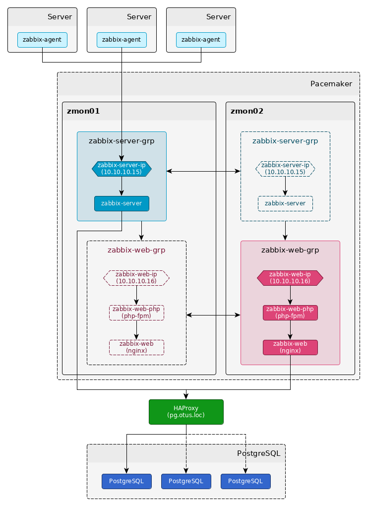


#### Развертывание

Развертывание проходит последовательной инсталляцией ПО *Zabbix* на узлы `zmon01` и `zmon02` и сохранением конфигурационных файлов.


#### Проверка работоспособности

* Проверим веб консоль *Zabbix* (http://10.10.10.16). Пользователь `Admin`, пароль `zabbix`:

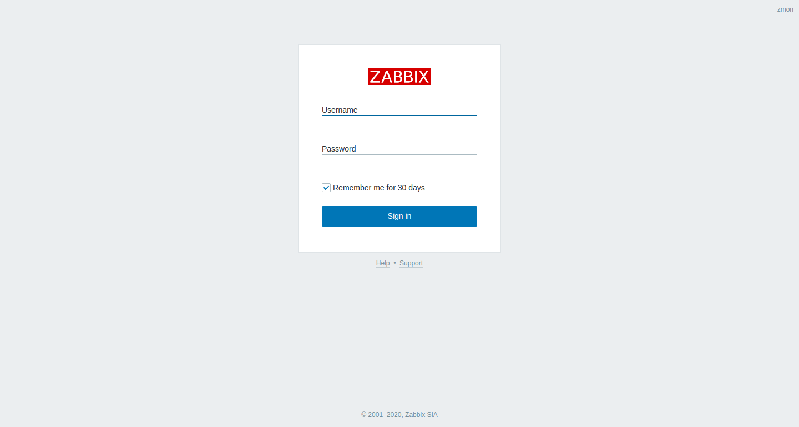

* Проверим, что осуществляется сбор информации со всех серверов комплекса:

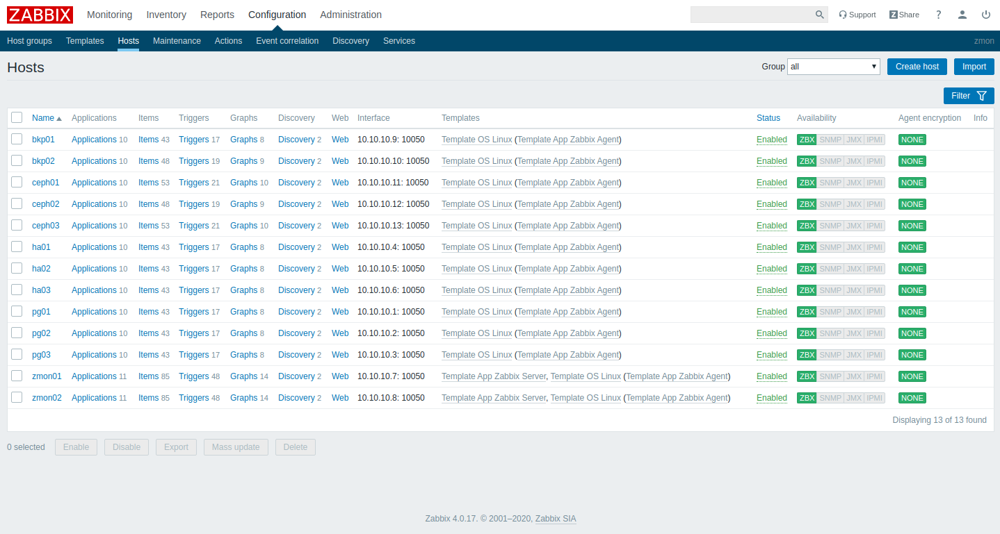
